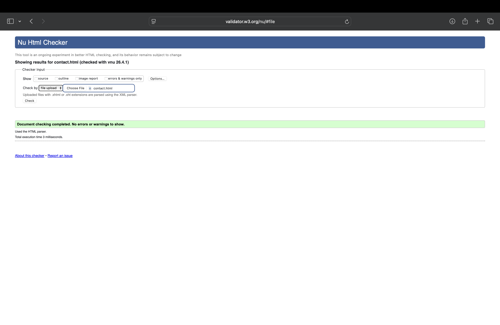
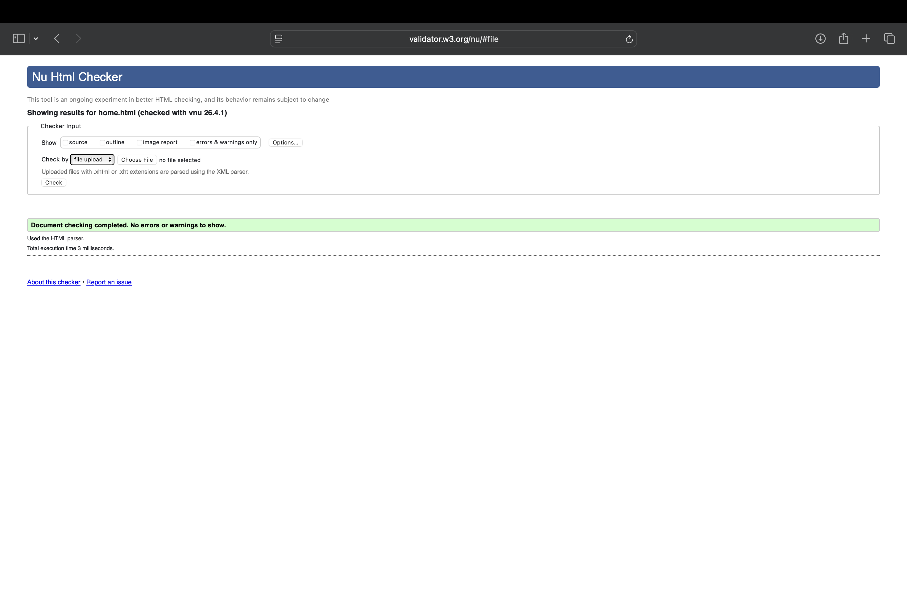
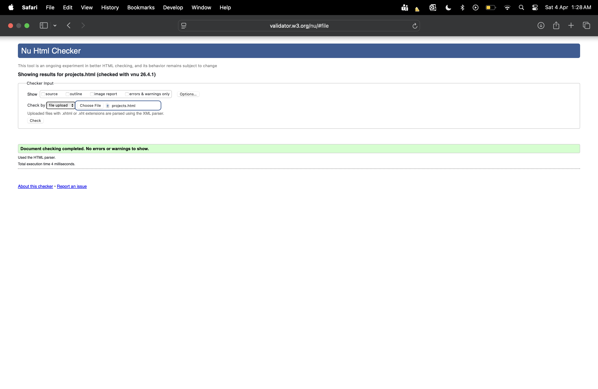
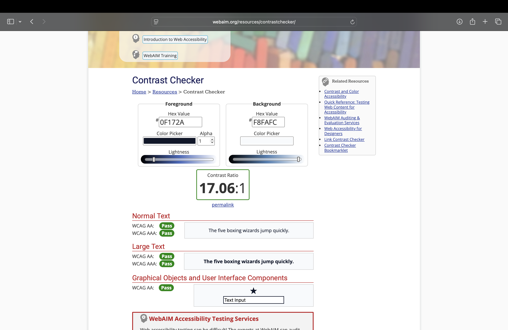
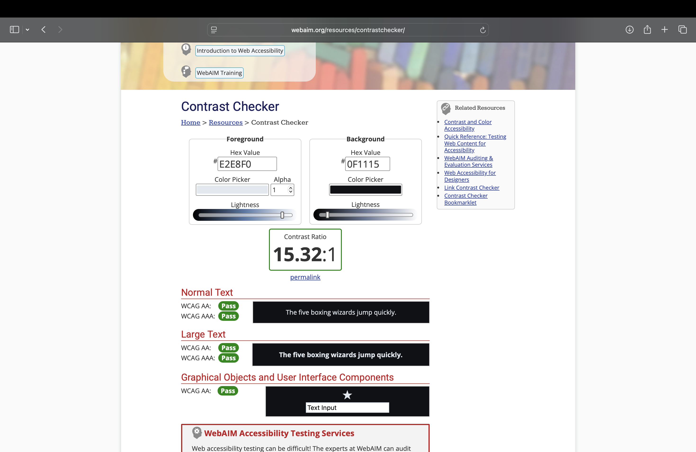
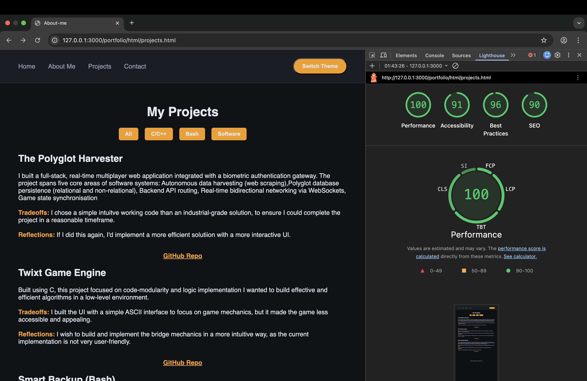

# Harish Manickam 
**Roll Number:** 2025115005

## D4 Feature Choices

**Group A — A1: Filterable & Bookmarkable Project Index**
I implemented multi-tag filtering on the Projects page using vanilla JS. This is a very useful feature and hence I chose it. A simple looking but a very important feature and the logic opened doors to various other approaches.

**Group B — B2: Collapsible Timeline with Event Delegation**
This is perfect for the timeline as it makes the timeline clean and minimal without making it look messy or too text heavy, the user may choose the interested box to look more into.

## Typographic Pairing
**Display font:** Poppins | **Body font:** Roboto

Poppings and Roboto are simple yet well structured that doesnt look too fancy or complicated. It's clean and minimalist font-style pleased me and it matches the tech vibe of my portfolio

## D3 Animation Justification

**Hero entrance ('entrance_fade' on '.home'):** Theatric effect of name spanning up , a simple yet clean introduction and welcome.
**Timeline item stagger ('fadeUp' on '.timeline-item'):** Enforces a chronological sequende of achievement and is well defined.

## Screenshots (add these after running the tools)

## Live URL
https://researchweb.iiit.ac.in/~harish.manickam/
